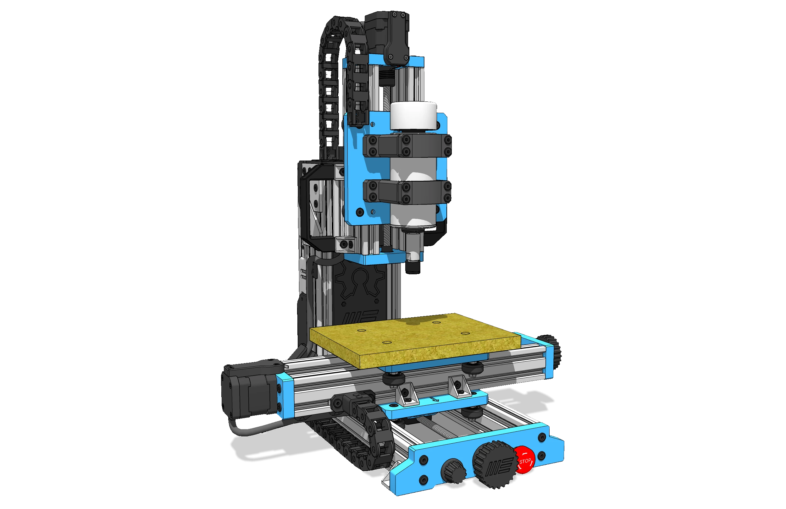

# Welcome to MY-PCB Mill Documentation

{ width="1000" }

## Desktop Precision for Electronic Prototyping.
Welcome to the official documentation for the MY-PCB Mill. Designed to bring high-precision circuit board manufacturing directly to your desktop, this Open Source CNC router is perfect for the Maker community and electronic engineers. Stop waiting for PCB deliveries and start milling your own prototypes instantly. Here you will find all the information you need to build, wire, and operate your digital fabrication mill.

!!! warning "Work In Progress (WIP) - Active Development"
    **The MY-PCB Mill is currently under active development.**
    
    Achieving the micron-level precision required for engraving fine PCB traces demands rigorous testing of lead screws, spindle runout, and structural rigidity. The current 3D CAD models, printed parts, and Bill of Materials (BOM) are actively being refined for the ultimate DIY experience. 
    
    *Want to start milling your own circuits?* Independent sourcing during this phase might result in mismatched linear rails, backlash nuts, or incompatible spindle mounts. To ensure you get the exact high-precision hardware we are testing and to support our Open Source project, we highly recommend getting your components directly from the [MY-Machines Official Store](https://www.my-machines.com).

-   :fontawesome-solid-book-open:{ .lg .middle } __Instruction Manual__

    ---

    In this section, you will find everything you need regarding the MY-PCB Mill assembly manuals, wiring guides, and initial setup.

    [:octicons-arrow-right-24: Find out more](operation/index.md)

-   :fontawesome-solid-screwdriver-wrench:{ .lg .middle } __Help with maintenance__

    ---

    Keep your axes moving smoothly. Learn how to lubricate linear rails, adjust anti-backlash nuts, and maintain the spindle.

    [:octicons-arrow-right-24: Find out more](maintenance/index.md)

-   :fontawesome-brands-app-store:{ .lg .middle } __Help with CAM Software__

    ---

    From generating G-Code from your Gerber files to configuring GRBL settings. Learn the software workflow for perfect PCB milling.

    [:octicons-arrow-right-24: Find out more](software/index.md)

-   :fontawesome-solid-triangle-exclamation:{ .lg .middle } __Troubleshooting__

    ---

    Experiencing broken V-bits, lost steps, or uneven engraving? Find structured solutions for common desktop CNC issues.

    [:octicons-arrow-right-24: Find out more](troubleshooting/index.md)

-   :fontawesome-solid-helmet-safety:{ .lg .middle } __Help with safety__

    ---

    Better safe than sorry. Learn how to handle fiberglass (FR4) dust safely and protect your eyes from high-speed debris.

    [:octicons-arrow-right-24: Find out more](safety/index.md)

-   :fontawesome-solid-wand-magic-sparkles:{ .lg .middle } __Learning with tips and tricks__

    ---

    Master the art of PCB milling. Discover advanced techniques like Z-axis height mapping (auto-leveling) and trace isolation optimization.

    [:octicons-arrow-right-24: Find out more](../tips-and-tricks/index.md)

## Didn't find what you were looking for?

Please contact us directly; we are here to help you build and learn.

<!DOCTYPE html>
<html lang="en">
<head>
    <meta charset="UTF-8">
    <meta name="viewport" content="width=device-width, initial-scale=1.0">
    <title>Contact Support</title>
    <link rel="stylesheet" href="https://cdnjs.cloudflare.com/ajax/libs/font-awesome/6.0.0-beta3/css/all.min.css">
</head>

    <a href="https://api.whatsapp.com/send?1=pt_pt&phone=351924244819" class="md-button" style="width: 200px; height: 54px;">
        WhatsApp <i class="fab fa-whatsapp" style="vertical-align: middle;"></i>
    </a>

    <a href="mailto:support@my-machines.com" class="md-button" style="width: 200px; height: 54px;">
        E-mail <i class="fas fa-paper-plane" style="vertical-align: middle;"></i>
    </a>

</html>