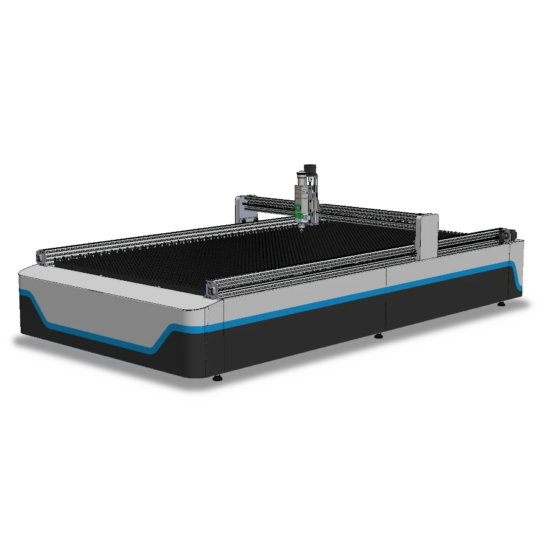

# Welcome to MY-FiberLaser 1015 Documentation

{ width="1000" }

## Industrial Metal Cutting, Democratized.
Welcome to the official documentation for the MY-FiberLaser 1015. Bridging the gap between the Maker workspace and heavy-duty industrial digital fabrication, this machine offers a precise 1000x1500mm working area. Powered by a robust 1000W CW Fiber Laser source and the highly efficient RayTools BT240S cutting head, this platform brings Open Source Fabrication principles to professional metalworking. 

Here you will find everything needed to assemble, calibrate, and safely operate your fiber laser.

!!! warning "Work In Progress (WIP) - Active Development"
    **The MY-FiberLaser is currently under active development.**
    
    Industrial-grade metal cutting with a Class 4 Fiber Laser demands rigorous safety standards, heavy-duty structural integrity, and precise cooling configurations. The current 3D drawings, dimensions, and layout are conceptual prototypes. 
    
    *Planning to step into industrial metal fabrication?* Sourcing heavy structural parts and high-power laser components on your own carries significant technical and financial risks right now. We invite you to support our mission to democratize digital fabrication by purchasing your verified, heavy-duty hardware directly through the [MY-Machines Official Store](https://www.my-machines.com).

-   :fontawesome-solid-book-open:{ .lg .middle } __Instruction Manual__

    ---

    Step-by-step guides covering everything from frame squaring to routing the QBH fiber optic cable without damage.

    [:octicons-arrow-right-24: Find out more](operation/index.md)

-   :fontawesome-solid-screwdriver-wrench:{ .lg .middle } __Help with maintenance__

    ---

    Keep your machine in peak condition. Learn how to clean the RayTools protective lenses and maintain the dual-circuit water chiller system.

    [:octicons-arrow-right-24: Find out more](maintenance/index.md)

-   :fontawesome-brands-app-store:{ .lg .middle } __Help with CAM & Nesting Software__

    ---

    Master the digital workflow. From vector preparation to setting up correct cutting parameters for steel, aluminum, and brass.

    [:octicons-arrow-right-24: Find out more](software/index.md)

-   :fontawesome-solid-triangle-exclamation:{ .lg .middle } __Troubleshooting__

    ---

    Dealing with dross, bad edge quality, or interlock alarms? Find structured solutions for common metal cutting issues.

    [:octicons-arrow-right-24: Find out more](troubleshooting/index.md)

-   :fontawesome-solid-helmet-safety:{ .lg .middle } __Help with safety (Class 4 Laser)__

    ---

    **Critical reading.** Understand 1080nm invisible radiation hazards, proper eyewear, and specular reflection management.

    [:octicons-arrow-right-24: Find out more](safety/index.md)

-   :fontawesome-solid-wand-magic-sparkles:{ .lg .middle } __Learning with tips and tricks__

    ---

    Push your fabrication skills. Learn about focus adjustment (zero focus calibration) and nozzle selection for different material thicknesses.

    [:octicons-arrow-right-24: Find out more](../tips-and-tricks/index.md)

## Didn't find what you were looking for?

Please contact our engineering team directly; we are here to help you scale your manufacturing capabilities.

<!DOCTYPE html>
<html lang="en">
<head>
    <meta charset="UTF-8">
    <meta name="viewport" content="width=device-width, initial-scale=1.0">
    <title>Contact Support</title>
    <link rel="stylesheet" href="https://cdnjs.cloudflare.com/ajax/libs/font-awesome/6.0.0-beta3/css/all.min.css">
</head>

    <a href="https://api.whatsapp.com/send?1=pt_pt&phone=351924244819" class="md-button" style="width: 200px; height: 54px;">
        WhatsApp <i class="fab fa-whatsapp" style="vertical-align: middle;"></i>
    </a>

    <a href="mailto:support@my-machines.com" class="md-button" style="width: 200px; height: 54px;">
        E-mail <i class="fas fa-paper-plane" style="vertical-align: middle;"></i>
    </a>

</html>